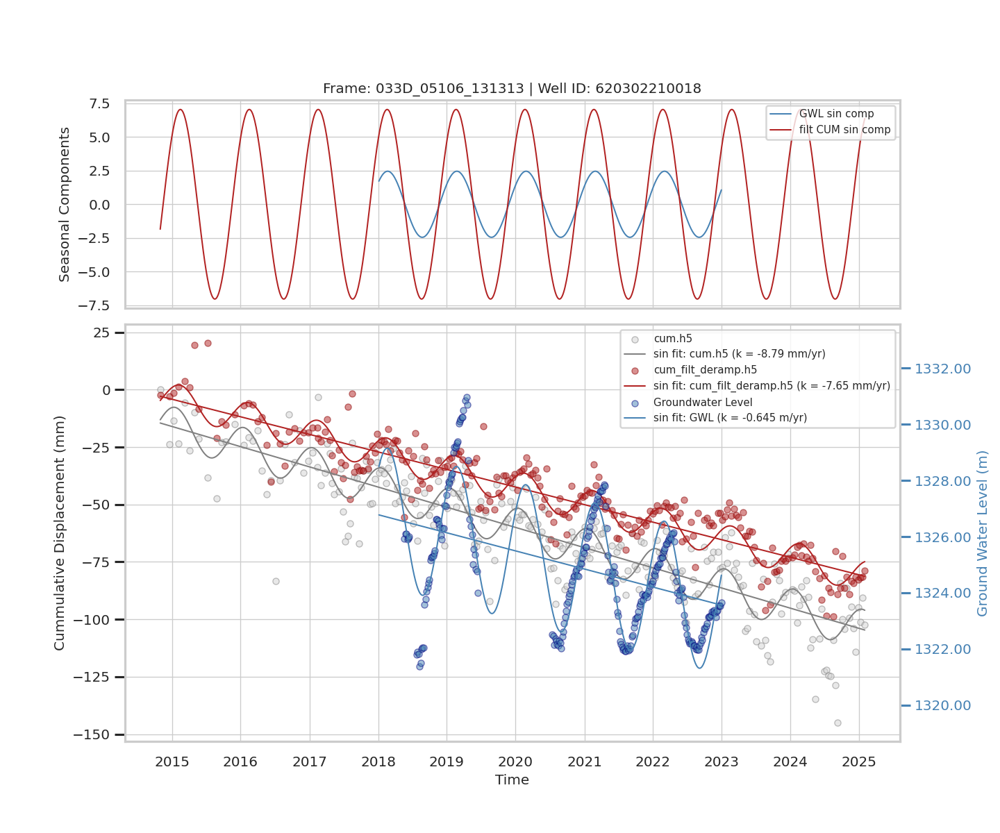
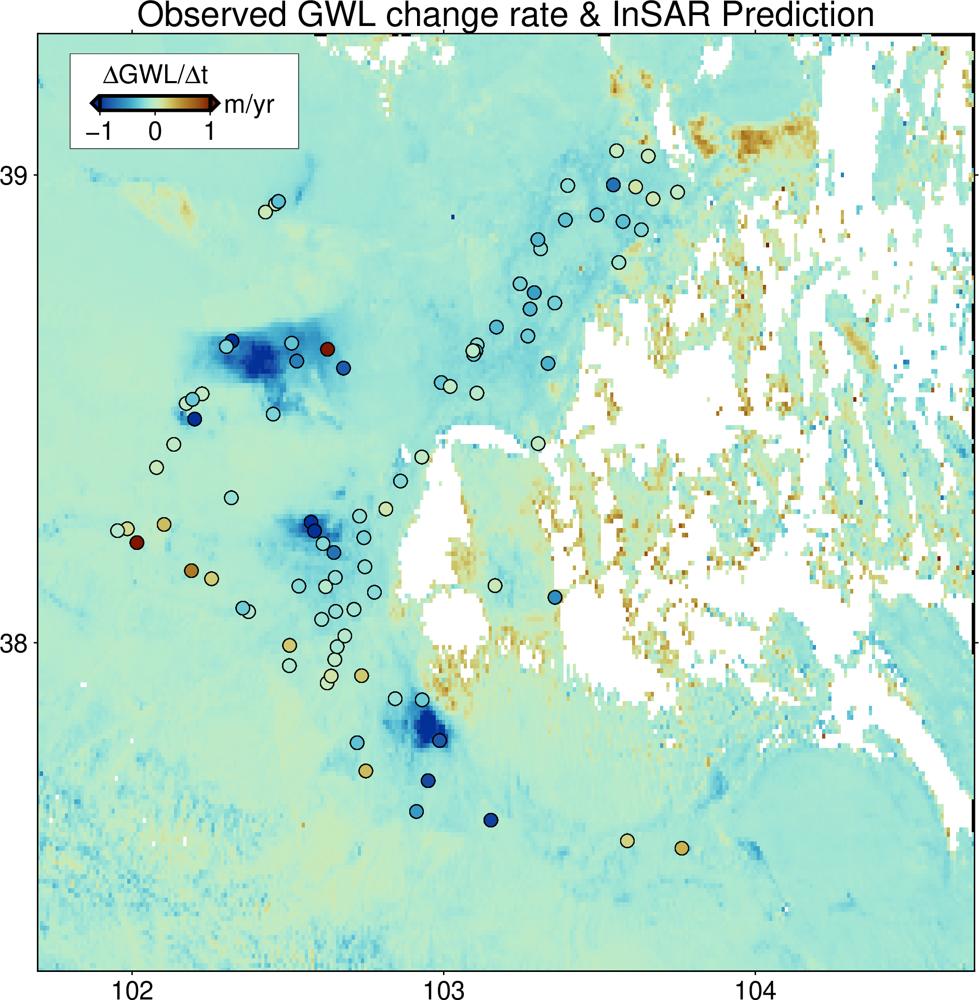

# GOBI — Groundwater Observation from InSAR

This project estimates groundwater level (GWL) change rates across the Shiyang Basin using InSAR-derived vertical displacement (VU) data, and validates the results against observed well measurements.

---

## Overview

The workflow has four main steps:

**Step 1 — Time series analysis and sinusoidal model fitting**

For each groundwater well, the observed GWL time series and the co-located InSAR cumulative displacement (cumU) are plotted together. A sinusoidal model is fitted to extract the linear trend (change rate) and seasonal component from both signals.

<!-- Insert figure: scatter plot of GWL vs InSAR cumU with model fit -->


**Step 2 — Regression: GWL change rate vs VU**

The GWL change rates from all wells are compared against InSAR VU values extracted at the same locations. A weighted least-squares (WLS) regression is fitted to derive the relationship:

```
GWL change rate = a × VU + b   (m/yr)
```

**Step 3 — Predict GWL change rate from InSAR VU**

The regression equation from Step 2 is applied to the full VU raster to produce a spatially continuous map of predicted GWL change rate, exported as a GeoTIFF file.

**Step 4 — Compare observed vs predicted GWL change rate**

The observed GWL change rates at individual wells are plotted on top of the predicted GWL change rate map to validate the results.

<!-- Insert figure: observed GWL change rate points on predicted raster map -->


---

## How to Use

### Prerequisites
- [Miniconda](https://docs.conda.io/en/latest/miniconda.html) or Anaconda installed
- GMT (Generic Mapping Tools) — install via `conda install -c conda-forge gmt`

### Steps

**1. Clone the repository**
```bash
git clone <repo-url>
cd your_working_directory
```

**2. Prepare input data**

Create a `data/` folder at the same level as `GOBI/` and place the following files inside:
```
data/
    GroundwaterLevel_2018-2023.csv   # UTF-8 encoded, comma-separated
    fid*.cum.h5                      # one or more InSAR cumulative displacement files
```

**3. Set up the environment**
```bash
cd GOBI/
source init_env.sh
```
This creates and activates the `gobi` conda environment (first run may take a few minutes).

**4. Run the time series analysis**
```bash
python scripts/plot_ts_new.py
```

Check outputs:
```
outputs/GWL_VU_ts/*.png              # time series plots per well
outputs/GWLcr_VU_ModelResult.csv     # model fit results
outputs/GWLvsVU.png                  # regression plot
outputs/gwl_cr_SYref.tif            # predicted GWL change rate raster
```

**5. Convert output raster to NetCDF**
```bash
gdal_translate -of netCDF ../outputs/gwl_cr_SYref.tif ../outputs/gwl_cr_SYref.nc
```

**6. Plot results on map**

Open `scripts/gmt_plot_points_on_raster.sh` and update the file paths at the top of the script to match your local directory, then run:
```bash
./scripts/gmt_plot_points_on_raster.sh
```

Check output:
```
outputs/gwlcr_on_vu.png
```

---

## File Structure

```
your_working_directory/
├── GOBI/                         # This repository
│   ├── scripts/
│   │   ├── get_vu.py
│   │   ├── gps_reference.py
│   │   ├── plot_ts.py
│   │   ├── plot_reg.py
│   │   ├── export_gwvel.py
│   │   ├── folium_map.py
│   │   ├── quick_plot.py
│   │   └── Address2Coord.py
│   ├── figures/                  # Figures for README
│   ├── environment.yml           # Conda environment
│   ├── init_env.sh               # Environment setup script
│   ├── gmt.conf
│   └── readme.md
├── data/                         # Input data (provided separately, not in repo)
└── outputs/                      # Output figures and maps
```

---

## Author

Lu Liang — School of GeoSciences, University of Edinburgh (2025–2026)
